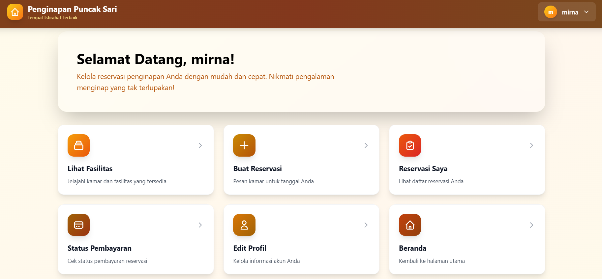
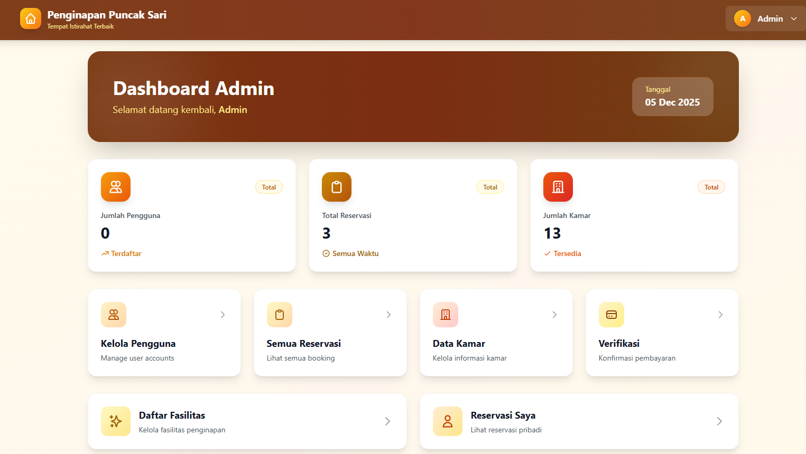

# Sistem Reservasi Penginapan Puncak Sari


Aplikasi berbasis Laravel yang digunakan untuk mengelola pemesanan kamar, fasilitas, pembayaran, dan manajemen pengguna. Sistem ini menyediakan dua peran utama yaitu **User** dan **Admin**, masing-masing dengan fitur operasional yang berbeda.

---

## Daftar Isi
- [Tentang Proyek](#tentang-proyek)
- [Fitur Utama](#fitur-utama)
- [Struktur Proyek](#struktur-proyek)
- [Teknologi yang Digunakan](#teknologi-yang-digunakan)
- [Instalasi](#instalasi)
- [Menjalankan Aplikasi](#menjalankan-aplikasi)
- [Cara Menggunakan Aplikasi](#cara-menggunakan-aplikasi)
- [Akun Admin Default](#akun-admin-default)
- [Kontributor](#kontributor)
- [Lisensi](#lisensi)

---

## Tentang Proyek

Sistem Reservasi Penginapan Puncak Sari merupakan aplikasi berbasis web yang dibangun menggunakan **Laravel Framework**. Aplikasi ini dirancang untuk memudahkan manajemen kamar, fasilitas, reservasi, pembayaran, serta manajemen pengguna.

Aplikasi ini mendukung:
- **User** → reservasi kamar, upload pembayaran, riwayat reservasi.
- **Admin** → verifikasi pembayaran, manajemen kamar, fasilitas, user, dan reservasi.

---

## Fitur Utama

### Fitur User
- Registrasi dan login
- Melihat fasilitas penginapan
- Melakukan reservasi kamar
- Upload bukti pembayaran
- Melihat status reservasi (Pending, Approved, Rejected)
- Check-in & Check-out

### Fitur Admin
- Dashboard admin
- CRUD User & Admin
- CRUD Kamar
- CRUD Fasilitas
- Melihat semua reservasi
- Approve / Reject reservasi
- Verifikasi bukti pembayaran

---

## 📂 Struktur Proyek

Struktur utama aplikasi Laravel:
 ```bash
app/
├── Http/
│ ├── Controllers/
│ ├── Middleware/
├── Models/
├── Services/
bootstrap/
config/
database/
├── migrations/
├── seeders/
public/
resources/
├── views/
routes/
storage/
   ```

Detail:
*   **Controllers** → logika utama aplikasi (`ReservasiController`, `FasilitasController`, dsb).
*   **Models** → representasi tabel database (`User`, `Kamar`, `Fasilitas`, `Reservasi`).
*   **Services** → layanan eksternal (misalnya `FonnteService`).
*   **Views** → file Blade untuk antarmuka aplikasi.
*   **Migrations & Seeders** → struktur tabel dan data awal.

---

## Teknologi yang Digunakan

| Teknologi | Deskripsi |
|----------|-----------|
| **Laravel** | Framework backend berbasis PHP. |
| **MySQL** | Database utama. |
| **XAMPP** | Web server lokal (Apache + MySQL). |
| **Composer** | Manajer paket PHP. |
| **Node.js & NPM** | Build asset frontend. |
| **TailwindCSS** | Styling antarmuka. |
| **GitHub** | Version control. |
| **VS Code** | Editor kode. |

---

## ⚙️ Instalasi & Setup

### Prasyarat

Pastikan Anda telah menginstal **PHP**, **Composer**, **Node.js** & **NPM**, dan **XAMPP** (Apache dan MySQL aktif).

### Langkah-Langkah

1.  **Clone Repository**

    ```bash
    git clone https://github.com/Mirnafebriasari/Reservasi-Penginapan.git
    cd Reservasi-Penginapan
    ```

2.  **Install Dependensi Laravel**

    ```bash
    composer install
    ```

3.  **Konfigurasi File `.env`**

    Ganti nama file .env.example menjadi .env
    
    Atur database (sesuaikan jika perlu):
    
    ```env
    DB_DATABASE=reservasi_db
    DB_USERNAME=root
    DB_PASSWORD=
    ```
    Jika anda ingin menghubungkan whatsapp API maka tambahkan token juga di .env
    
    ```env
    FONNTE_API_KEY=sUv9Sd293fd3Re6pbry1 #Silahkan sesuaikan dengan token yang anda sudah daftarkan di fonnte.con
    ```

5.  **Jalankan XAMPP**

    Aktifkan: `Apache` dan `MySQL`.

6.  **Migrasi & Seeder**

    ```bash
    php artisan migrate --seed
    ```

7.  **Generate `APP_KEY`**

    ```bash
    php artisan key:generate
    npm install
    ```

8.  **Buat Storage Link**

    ```bash
    php artisan storage:link
    ```
9. **Menjalankan Aplikasi**

    ```bash
    php artisan serve
    ```

10.  **Run Vite di terminal terpisah**

        ```bash
         npm run dev  
        ```

11. Buka:
    http://127.0.0.1:8000/

---


**Cara Menggunakan Aplikasi**
1. User


   
A. Registrasi

    - Buka halaman utama
    - Klik Register
    - Isi nama, email, password
    - Login sebagai user

B. Melihat Fasilitas

    - Klik Daftar Fasilitas

C. Membuat Reservasi

    - Klik Tambah Reservasi
    - Pilih kamar dan tanggal
    - Sistem menghitung total otomatis
    - Klik Simpan

D. Melakukan Pembayaran

    - Masuk menu Pembayaran
    - Upload bukti transfer

E. Menunggu Verifikasi Admin

    - Status akan berubah menjadi:
        Pending
        Approved
        Rejected

F. Check-in & Check-out

    - Bisa dilakukan setelah pembayaran disetujui.

2. Admin



Admin dapat:

    - Mengelola user & admin
    - Mengelola fasilitas
    - Mengelola kamar
    - Mengelola semua reservasi
    - Approve/Reject pembayaran
    - Melihat riwayat reservasi

🔐 Akun Admin Default
Akun awal yang dibuat melalui seeder:

 ```bash
Email: admin@gmail.com
Password: admin123
```

👨‍💻 Kontributor
Kelompok 6 – Pemrograman Web

 ```bash
Nama	                NIM
Mirna Febriasari	    H071241078
Siti Nur Halisa Tahir	H071241086
Angel Catrina Sobbu	    H071241094
```

📄 Lisensi
Proyek ini dibuat untuk keperluan pembelajaran dan dapat dimodifikasi sesuai kebutuhan.
